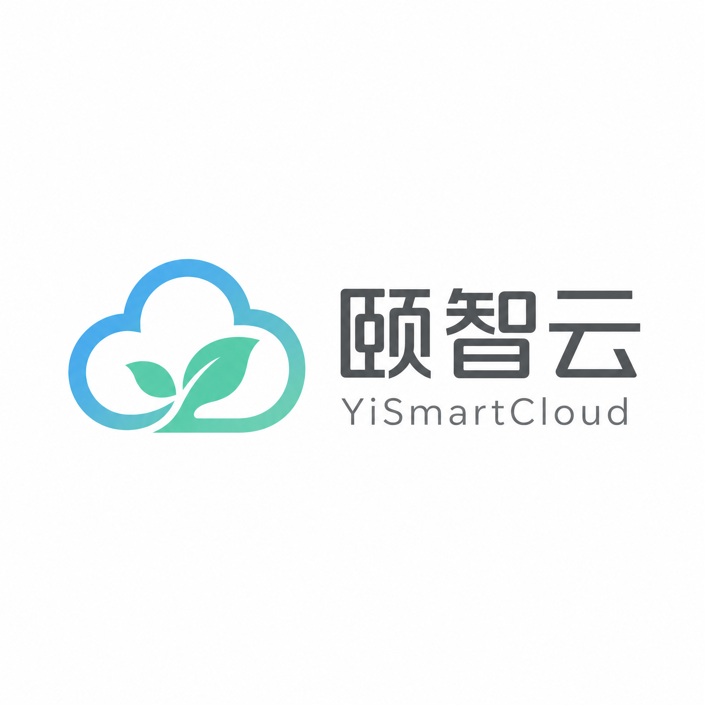
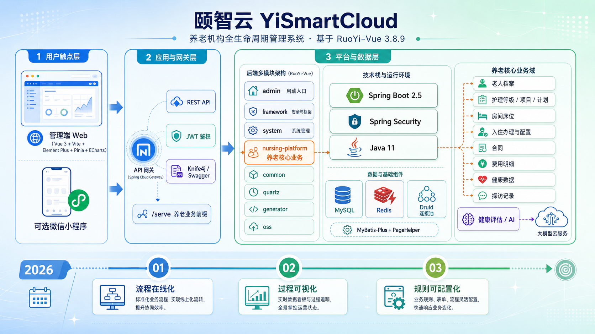
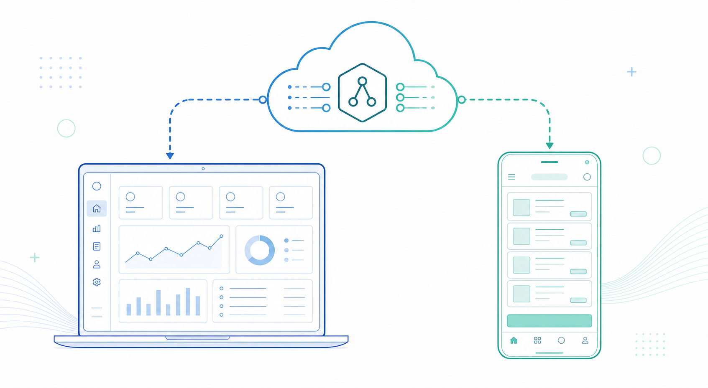
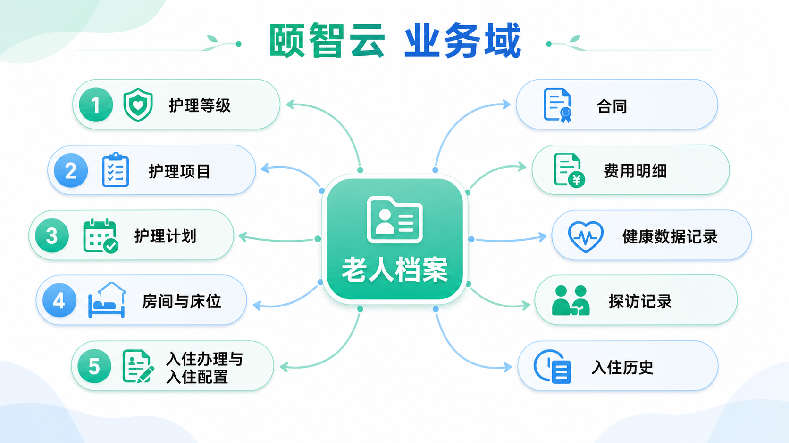
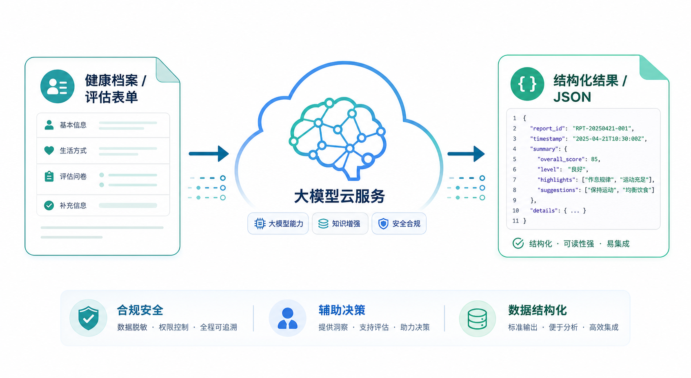
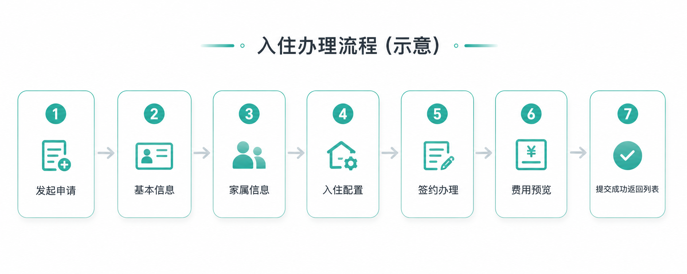
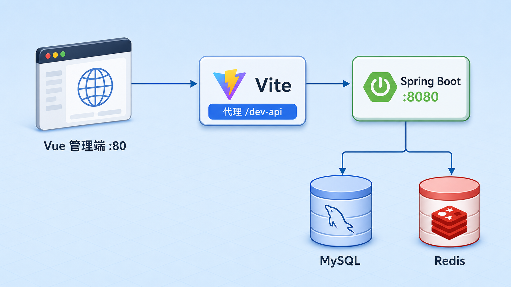

<p align="center">
  
</p>

# 颐智云（YiSmartCloud）项目说明

<p>
  
  
  
  
  
  
  
  
</p>

<p>
  
  
  
</p>

`YiSmartCloud`（颐智云）是一套面向养老机构的**智慧养老管理系统**，前后端分离，以「老人全生命周期服务管理」为主线；其中**老人侧运营**优先围绕**入住办理、床位与护理等级配置、在院主数据**，并预留**护工 / 照护员派工与排班**与护理计划、员工主数据的衔接。同时覆盖房间床位、合同与费用、健康记录等场景。项目在 **RuoYi-Vue 3.8.9** 之上做业务化扩展：不是简单套模板，而是贴近机构真实运营流程的一体化平台；后端与前端 `package.json` 版本与若依基线对齐，便于对照官方升级说明。

业务上侧重三点：**流程在线化**（可追踪、可审批、可沉淀）、**过程可视化**（老人与床位状态、服务与费用一目了然）、**规则可配置化**（菜单权限、字典、参数与代码生成降低迭代成本）。仓库包含 Vue3 管理端、Spring Boot 多模块后端、SQL 脚本，以及可选的微信小程序目录 `mp-weixin`，适合学习演练与团队二次开发。

> 🕒 **首次 Git 提交时间：2026-02-27 01:01:02 +0800**（状态见上方徽章）

### 架构示意图

<p align="center">
  
</p>

<p align="center"><sub>上图用于总览产品与技术分层；网关、微服务拆分等以实际部署与代码为准。</sub></p>

---

## 1. 📂 仓库结构总览

仓库根目录核心结构如下：

- 📁 `YiSmartCloud-front`：前端管理端（Vue3 + Vite + Element Plus）
- ☕ `YiSmartCloud-background`：后端服务（Spring Boot 多模块 Maven 工程）
- 🗄️ `YiSmartCloud-background/sql`：数据库初始化与业务菜单脚本
- 💬 `mp-weixin`：微信小程序端工程（微信开发者工具直接打开该目录；接口域名需在小程序后台配置合法 request 域名，生产环境需 HTTPS）
- 📝 `docs/code_review`：代码改动记录（按时间命名，便于审计）
- 🤖 `.cursor/rules`：项目内 AI 协作规则与编码约束
- 🖼️ `assets/readme/`：README 用示意图（Logo、架构、业务域、流程、联调拓扑等）

### 多端形态（示意）

<p align="center">
  
</p>

<p align="center"><sub>管理端与小程序为不同工程，共用后端 API；小程序上线需配置合法域名与 HTTPS。</sub></p>

后端 `YiSmartCloud-background` 是多模块聚合工程，根 `pom.xml` 管理版本与依赖，包含以下模块：

- 🚀 `YiSmartCloud-admin`：Web 服务入口、启动类与统一配置
- 🧱 `YiSmartCloud-framework`：安全、Redis、全局配置等基础框架能力
- 👥 `YiSmartCloud-system`：系统管理模块（用户、角色、菜单、字典等）
- ⏰ `YiSmartCloud-quartz`：定时任务模块
- 🪄 `YiSmartCloud-generator`：代码生成模块
- 🧩 `YiSmartCloud-common`：公共工具与通用封装
- 🏥 `YiSmartCloud-nursing-platform`：养老业务核心模块
- ☁️ `YiSmartCloud-oss`：对象存储相关能力

---

## 2. 🧰 技术栈（按当前代码真实扫描）

### 2.1 💚 前端（`YiSmartCloud-front`）

- 核心框架：`Vue 3.4.31`
- 构建工具：`Vite 5.3.2`
- 路由：`Vue Router 4.4.0`
- 状态管理：`Pinia 2.1.7`
- UI 组件：`Element Plus 2.7.6`
- 图表：`ECharts 5.5.1`
- 网络请求：`Axios 0.28.1`
- 其他常用库：
  - `@element-plus/icons-vue`
  - `@vueuse/core`
  - `@vueup/vue-quill`
  - `js-cookie`
  - `jsencrypt`
  - `nprogress`
  - `vuedraggable`
- 工程插件：
  - `@vitejs/plugin-vue`
  - `unplugin-auto-import`
  - `vite-plugin-compression`
  - `vite-plugin-svg-icons`

### 2.2 ☕ 后端（`YiSmartCloud-background`）

- Java 版本：`JDK 11`
- 核心框架：`Spring Boot 2.5.15`
- 安全框架：`Spring Security 5.7.12`
- ORM / 持久层：
  - `MyBatis-Plus 3.5.2`
  - `PageHelper 1.4.7`
- 数据源连接池：`Druid 1.2.23`
- 鉴权方式：`JWT (jjwt 0.9.1)` + Redis
- API 文档：`Springfox 3`（`DocumentationType.OAS_30`，OpenAPI 3 风格）+ `Knife4j 3.0.3`；与部分资料中的 “springdoc-openapi” 不是同一套依赖，联调时以本仓库 `SwaggerConfig` 为准
- 工具组件：
  - `fastjson2 2.0.53`
  - `Apache POI 4.1.2`（Excel 导入导出）
  - `Velocity 2.3`（代码生成模板）
  - `kaptcha 2.3.3`（验证码）
  - `OSHI 6.8.1`（系统信息监控）
- 数据库：`MySQL 8.x`（驱动 `mysql-connector-java`）
- 缓存：`Redis`（Lettuce 连接池）
- AI 接入（可选）：百度千帆 OpenAI 兼容接口（依赖 `openai-java`，通用封装见 `YiSmartCloud-common` 中的 `QianfanChatSupport`）

> 说明：以上版本来自 `package.json`、`pom.xml`、`application*.yml` 及根 `pom.xml` 依赖管理的实际扫描。

---

## 3. 🏥 业务模块能力（当前已落地）

养老业务 HTTP 接口多为 **`/serve/...`** 前缀，与前端 `src/api/serve/` 及开发代理 `/dev-api` 组合使用（例如请求路径形如 `/dev-api/serve/...`）。

### 业务域关系（示意）

<p align="center">
  
</p>

<p align="center"><sub>示意图侧重概念归类；表结构、接口路径以代码与 SQL 为准。</sub></p>

从前端 `src/views/serve` 与后端 `nursing-platform/controller` 对应关系来看，当前养老业务主要包括：

- 👴 `elder info` 在院老人主数据（与入住联动；护工分配建议在排班/派工能力中对接 `elder_id`）
- 📶 `nursing level` 护理等级管理
- 📋 `nursing project` 护理项目管理
- 📅 `nursing plan` 护理计划管理
- 🚪 `room` 房间管理
- 🛏️ `bed` 床位管理
- 🩺 `health record` 健康数据记录
- 🚶 `visit record` 探访记录
- 📜 `check-in record` 入住历史记录
- 🏠 `check-in` 入住办理
- ⚙️ `check-in config` 入住配置
- 📄 `contract` 合同管理
- 💰 `bill detail` 费用明细（后端控制器已存在）
- 🤖 `health assessment` 健康评估（含可扩展的 AI 辅助分析能力，详见 `HealthAssessmentController` 与相关 SQL）

同时保留 RuoYi 标准系统能力：用户、角色、部门、菜单、字典、参数、日志、任务调度、代码生成、缓存监控等。

### 健康评估与 AI（概念示意）

<p align="center">
  
</p>

<p align="center"><sub>AI 输出需结合业务校验与人工审核；上图仅为能力示意，非医疗诊断结论。</sub></p>

---

## 4. 🛏️ 入住办理近期改造说明（重点）

最近对「入住办理」做了交互升级：列表发起申请改为**独立申请页**，分区更清晰、步骤更直观。

### 申请页流程（示意）

<p align="center">
  
</p>

<p align="center"><sub>与真实页面字段、校验规则以代码为准；路由与接口见下列文件。</sub></p>

变更要点：

1. 🔀 列表页「发起入住申请」改为跳转独立页面，不再使用同页简化表单。
2. 🧩 独立页面按业务分区，包含：
   - 👤 基本信息
   - 👨‍👩‍👧 家属信息
   - ⚙️ 入住配置
   - ✍️ 签约办理
   - 💳 费用预览
3. ✅ 提交仍调用入住新增接口，成功后返回入住列表。
4. 🔗 路由入口：`/serve/checkIn-apply/index`。

相关关键文件：

- `YiSmartCloud-front/src/views/serve/checkIn/index.vue`
- `YiSmartCloud-front/src/views/serve/checkIn/apply.vue`
- `YiSmartCloud-front/src/router/index.js`
- `YiSmartCloud-front/src/api/serve/checkIn.js`

---

## 5. 💻 本地开发环境要求

建议环境：

- ☕ JDK `11`
- 📦 Maven `3.8+`
- 🟢 Node.js `18+`（推荐 LTS）
- 🐬 MySQL `8.x`
- 🔴 Redis `6.x / 7.x`
- 🔧 Git `2.3+`

Windows / macOS / Linux 均可运行；若在 Windows 下开发，请将终端与编辑器统一为 **UTF-8** 编码。

### 本地联调拓扑（示意）

<p align="center">
  
</p>

<p align="center"><sub>端口以本地配置为准（常见为前端 80、后端 8080）；生产环境需单独规划域名与 TLS。</sub></p>

---

## 6. ☕ 后端启动步骤（开发环境）

### 6.1 🗄️ 初始化数据库

先创建数据库（名称可自定义），再导入 SQL 脚本。仓库中可参考：

- `YiSmartCloud-background/sql/ry_20250417.sql`
- `YiSmartCloud-background/sql/quartz.sql`
- `YiSmartCloud-background/sql/nursing_project/*.sql`
- `YiSmartCloud-background/sql/other/*.sql`

> 不同脚本可能有业务迭代差异，建议按“基础表 -> 业务表 -> 菜单脚本”顺序导入，并在本地做一次字段核对。

### 6.2 📝 修改配置

重点检查以下文件中的数据库与缓存配置：

- `YiSmartCloud-background/YiSmartCloud-admin/src/main/resources/application.yml`
- `YiSmartCloud-background/YiSmartCloud-admin/src/main/resources/application-druid.yml`

必须按本地环境修改：

- MySQL 地址、端口、库名、账号、密码
- Redis 地址、端口、密码
- 上传目录 `ruoyi.profile`
- JWT 秘钥（建议替换默认值）
- OSS 相关配置（如启用）

### 6.3 ▶️ 启动后端

在 `YiSmartCloud-background` 目录执行：

```bash
mvn clean install -DskipTests
mvn -pl YiSmartCloud-admin spring-boot:run
```

默认端口：`8080`  
启动类：`org.FlyingSparrow.YiSmartCloud.YiSmartCloudApplication`

---

## 7. 💚 前端启动步骤（开发环境）

在 `YiSmartCloud-front` 目录执行：

```bash
npm install
npm run dev
```

默认开发端口：`80`（见 `vite.config.js`）  
开发代理前缀：`/dev-api` -> `http://localhost:8080`

构建命令：

```bash
npm run build:stage
npm run build:prod
```

环境变量文件：

- `.env.development`
- `.env.staging`
- `.env.production`

### 7.1 💬 微信小程序（`mp-weixin`，可选）

与 PC 管理端独立：在微信开发者工具中选择「导入项目」，项目目录指向仓库根下的 `mp-weixin`。请求后端 API 时，需将小程序 **request 合法域名**、**uploadFile 合法域名** 等配置为实际部署的后端域名（生产须 HTTPS），并与后端跨域、鉴权方式保持一致。

---

## 8. 🔌 接口文档与联调建议

当前后端已集成 Springfox（OAS 3）+ Knife4j。启动成功后可访问（以本地为例）：

- 📄 OpenAPI JSON：`/v3/api-docs`（Springfox 3 默认路径之一）
- 📖 文档 UI：一般为 Knife4j 的 `/doc.html`；亦可尝试 `/swagger-ui/index.html`（以 `SecurityConfig` 白名单与静态资源配置为准）

联调建议：

1. 🖥️ 先保证后端 8080 可访问；
2. 🔗 前端再通过 `/dev-api` 代理调用；
3. 🔑 如出现 401，先检查登录态 token 与权限标识；
4. 🧪 如接口通但页面空白，优先检查字段命名与后端 VO 返回结构是否一致。

---

## 9. 🛡️ 配置与安全注意事项

当前仓库配置中可见示例连接信息（数据库、Redis、Druid 控制台、OSS），在真实部署前请务必处理：

- 🔐 不要将真实生产密码写入仓库；
- 🧷 推荐通过环境变量或外部配置中心注入敏感值；
- 🎫 上线前替换 JWT secret；
- 🚧 限制 Druid 控制台访问白名单；
- 👤 根据最小权限原则分配数据库账号权限。

---

## 10. 🤝 Git 与协作规范（本仓库约定）

1. 📄 所有代码/文档统一 UTF-8；
2. 📋 每次代码变更需在 `docs/code_review` 新增记录文件；
3. 🧹 临时构建文件不要提交到 Git；
4. 🔄 前后端接口改动需同步更新文档与页面字段。

仓库 `.gitignore` 中已包含下列规则（防止 Vite 运行时时间戳快照等误提交）：

- `**/vite.config.js.timestamp-*.mjs`
- `.vite/`

项目内 Cursor / 协作向的说明与约定见目录：

- `.cursor/rules/`（如 UTF-8 编码、变更记录 `docs/code_review`、前后端约定等）

---

## 11. ❓ 常见问题（FAQ）

### Q1：🔍 前端启动后接口 404？

先确认后端是否在 `8080` 启动；再检查前端请求是否走了 `/dev-api` 前缀；最后检查 `vite.config.js` 代理是否被改动。

### Q2：🧭 登录成功后菜单为空？

通常是角色菜单权限未分配，或后端菜单数据未初始化完整。先检查系统管理里的角色/菜单绑定，再确认 SQL 菜单脚本是否执行。

### Q3：🗃️ 导入 SQL 后部分业务页面报字段不存在？

说明你的 SQL 版本与当前代码不一致。请按业务模块的最新 `table.sql`、`table2.sql` 进行增量比对。

### Q4：📎 上传图片/文件失败？

确认 `ruoyi.profile` 目录有写权限；若走 OSS，需确认 OSS endpoint 与 key 配置正确。

---

## 12. 🗺️ 后续建议

- 🧩 评估将「入住申请」拆为聚合 DTO 或分步接口，减少前端拼装与重复提交风险。
- 🧪 为护理核心链路补充集成测试（入住、退住、床位占用冲突等）。
- 🐳 补充标准化部署说明（Docker Compose / K8s 等）。
- 📚 前后端 README 保持关键信息同步（端口、代理、环境变量、业务变更）。
- 🖼️ 仓库内另有宽屏背景素材 `assets/readme/background_readme_banner.png`，可按需用于活动页或登录页视觉。

---

📌 许可证：MIT License  
👤 项目所有者：Siborne  
🔗 仓库：`YiSmart-Cloud`

